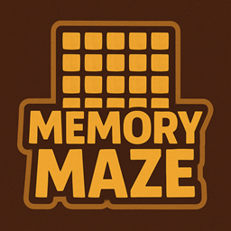
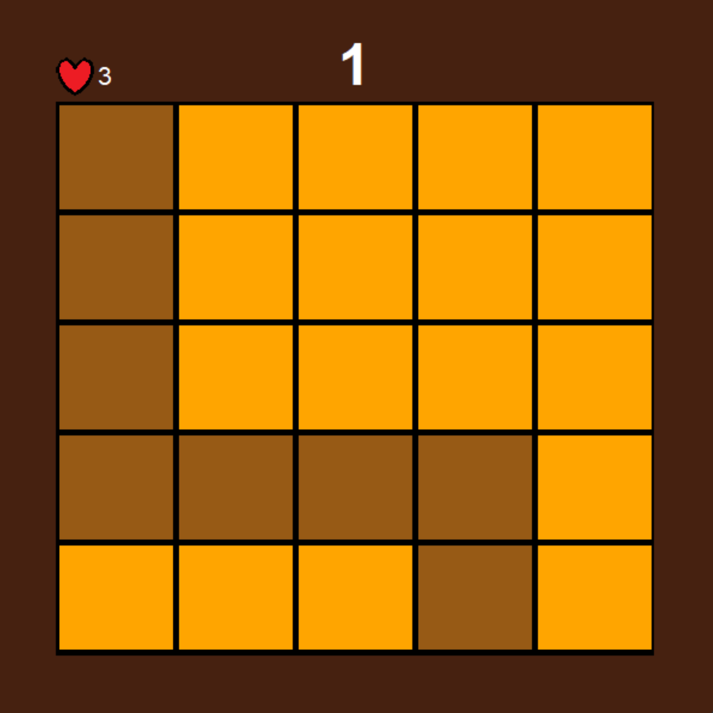
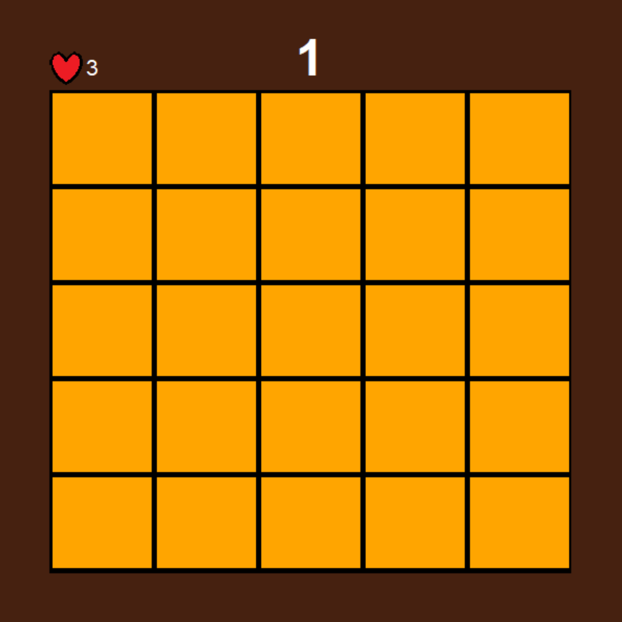
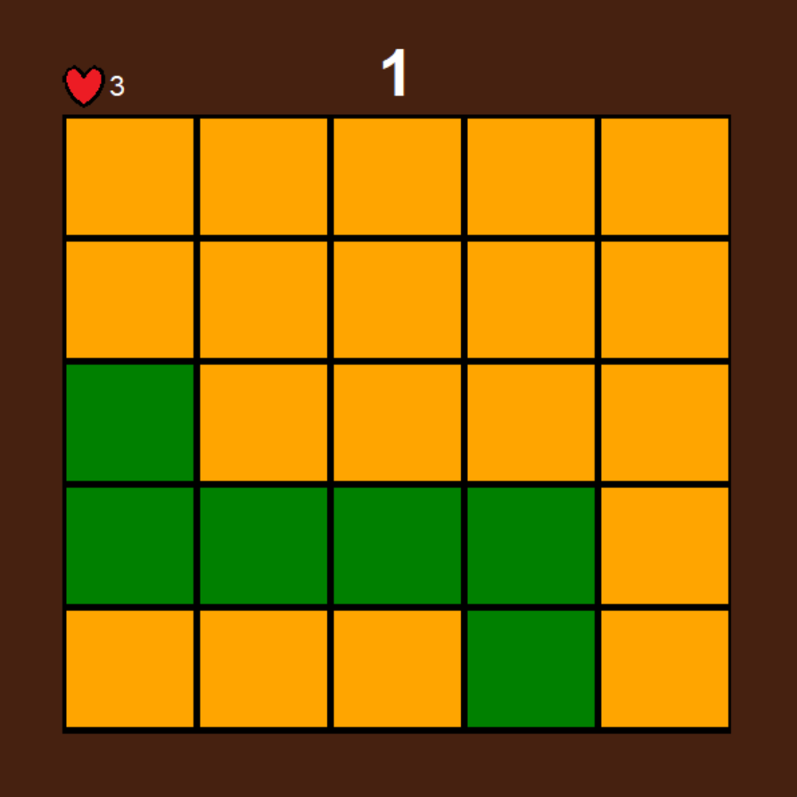
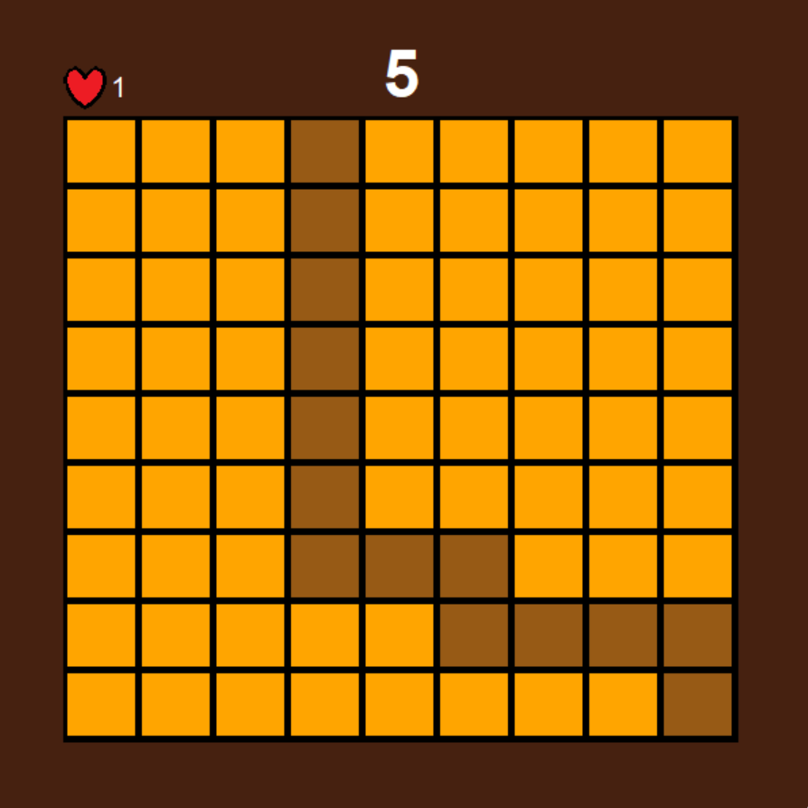

### How good is your memory?

Watch the path, and see if you can repeat it exactly. Be careful, you only have 3 incorrect guesses!

### What level can ***you*** get to?

## Developing

- Make sure [Python 3.9+](https://www.python.org/) is installed.
- Clone the repo.
- Run with `python -m memorymaze` (or `python3 -m memorymaze` in Unix-like environments).

Easy as that! This game uses Tkinter, which ships with the standard installation of Python, so no third-party libraries should be required.

## Building as a .exe

- Run `build.bat`.
- A `memory-maze.zip` is available in the `dist` directory.
